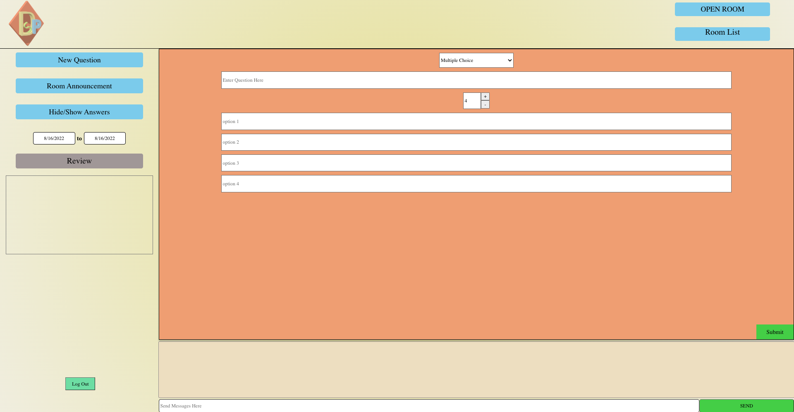

# DynaSoar Polling App (Frontend)

## Project Description

A teaching app for improving student engagement! 

## Technologies Used

- PostgreSQL
- Express
- React
- Node 

## MVP 

-Functional socket connections
-Functional bi-directional messaging from frontend to backend
-Full CRUD
-User Authentication with JWT and utilize protected routes on both frontend and backend

## Pitch Deck 

https://docs.google.com/presentation/d/1Fw76LgxFQCULuVOrQ63U15c2cZkUd0kwjMNDSGNVdmM/edit?usp=sharing

## Link to Development Board

https://github.com/users/steves3142/projects/1/views/1

## Component Hierarchy Diagram

