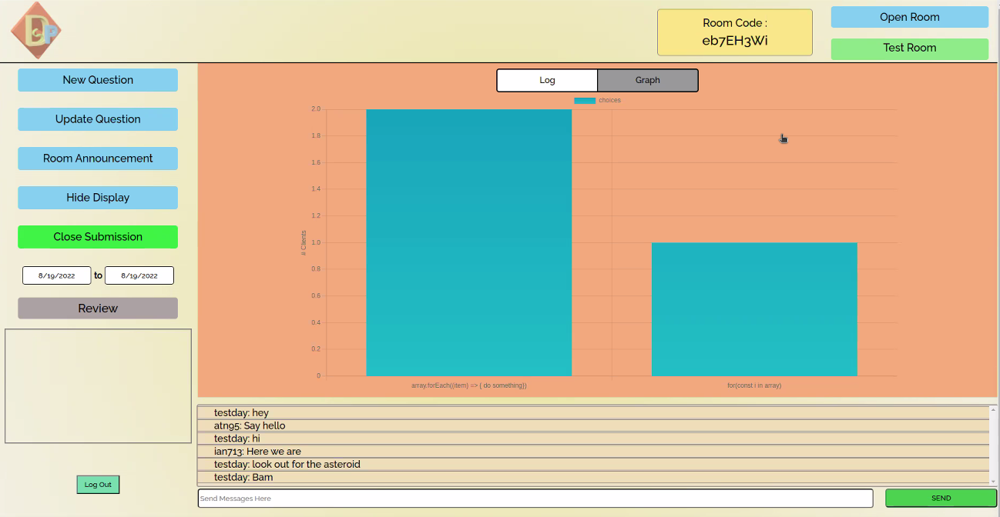
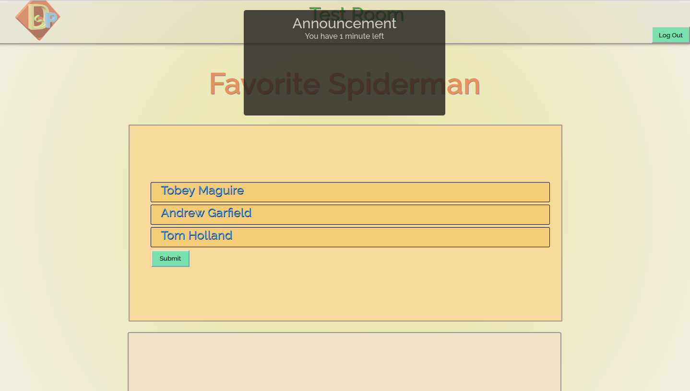

# DynaSoar Polling App (Frontend)
## By: 
## An Nguyen ([Github](https://github.com/atn95/) | [LinkedIn](https://www.linkedin.com/in/atn95/))
## Ian Hansson ([Github](https://github.com/ian713hansson) | [LinkedIn](https://www.linkedin.com/in/ian-hansson/))
## Steve Susanibar  ([Github](https://github.com/steves3142) | [LinkedIn](hhttps://www.linkedin.com/in/steve-susanibar/))
#

## Project Description

### With the pademic in 2020 everything has became remote. This project was designed to give teachers or conference host the ability to poll and get response in real time from from everyone. We added dynamic data charting as responses come in along with a notification system for the host to announce to everyone within the room. All questions asked will be logged and be available to review.

#

#
## Technologies Used
- JavaScript
  - Node
    - Express
    - SocketIO
  - React
    - SocketIO client
    - ChartJs
- HTML
- CSS

- PostgreSQL
- Studio One by PreSonus
#

## Application Link

http://dynasoar.herokuapp.com/ 

## Backend Repository

https://github.com/steves3142/dynamic_polling_backend 

## Task List
### - [ ] User prepopulated question library
### - [x] ~~Pulling question logs~~
### - [x] ~~Protected frontend and backend routes~~
### - [x] ~~User Auth~~
### - [x] ~~Modularizing rooms~~
### - [x] ~~Realtime Chat~~
### - [x] ~~Realtime Data recieve and Send~~
### - [x] ~~Socket connection between server and client~~
### - [x] ~~Backend Routes Established~~
### - [x] ~~Express connected to PSQL along with model generation~~

## Pitch Deck

https://docs.google.com/presentation/d/1Fw76LgxFQCULuVOrQ63U15c2cZkUd0kwjMNDSGNVdmM/edit?usp=sharing

## Link to Development Board

https://github.com/users/steves3142/projects/1/views/1

## Component Hierarchy Diagram

